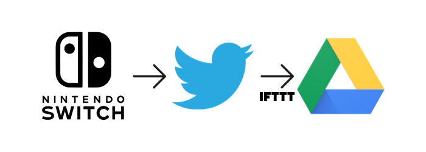

# Switch Downloader
After getting tired from trying a lot of different solutions, I decided to create a simple bot to grab my Nintendo Switch images and videos uploaded to Twitter with a little help from IFTTT and upload them to a folder on my Google Drive.

## Requirements
To run this bot, a valid Twitter Developer account is required, with the according values set:

`API_KEY`, `API_SECRET_KEY`, `ACCESS_TOKEN` and `ACCESS_TOKEN_SECRET`

Your Google Drive's account developer mode must also be activated and the `credentials.json` is expected to be dropped at the root of the project or via the environment variable `GDRIVE_CREDENTIALS` and a Google Drive folder must also be specified via `GDRIVE_FOLDER_NAME`. 

**IMPORTANT**: If you're deploying Switch Downloader via a server, the OAuth secret must be Web-server and the redirect page should be `https://www.example.com/oauth2callback`

To install the project dependencies you only need to run `pip install -r requirements.txt`

After deploying the project on Heroku (or on a dedicated server), on IFTTT, a new recipe must be created where the **THIS** should be "New Tweet by you with hashtag" with the hashtag `#NintendoSwitch` and the **THAT** should have the `Webhooks` service selected. The expected method is `POST`.

## Run the project
`gunicorn downloader:app`, or deploy with Heroku.

Before being able to start using the bot, it is required to authenticate the server at `https://www.example.com/authorize`. After authorizing, the server is now ready to receive requests to scan and download Switch submited media.